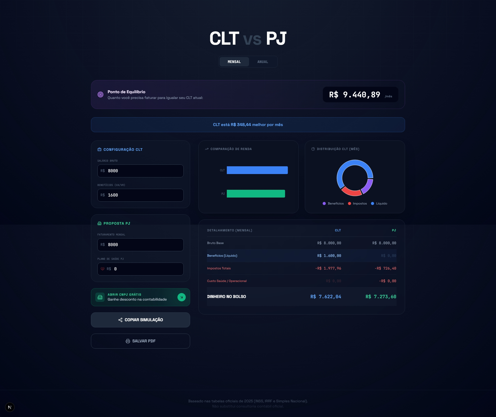

# 📊 CLT vs PJ Simulator 2026


> **Discover the mathematical truth behind your job offer.**
> A high-precision financial tool designed for Brazilian professionals to compare CLT (Labor Laws) vs PJ (Legal Entity) contracts with real-time tax optimization strategies.

<div align="center">
  
</div>

---

## 🚀 Features

This isn't just a simple calculator. It's a full-fledged financial simulator built with modern web technologies.

- **⚡ Real-time Tax Calculation:** Instant updates for IRRF, INSS, and Simples Nacional (Annex III & V).
- **🧠 Factor R Optimization:** Automatically detects if the "Factor R" strategy (Payroll Ratio ≥ 28%) reduces the tax burden from 15.5% to ~6%.
- **🎯 Break-even Point Algorithm:** Uses a binary search algorithm to calculate the exact PJ revenue needed to match a CLT net salary.
- **🔗 Shareable State:** URL synchronization via custom hooks allows users to share their exact simulation scenarios with recruiters or peers.
- **📊 Data Visualization:** Interactive Bar and Donut charts powered by **Recharts**.
- **🌑 Cyberpunk UI:** A modern, dark-mode-first interface built with **Tailwind CSS** and **Framer Motion**.
- **📱 Responsive & Print Friendly:** Optimized for mobile devices and generates clean PDF reports via browser print.

---

## 🛠️ Tech Stack

This project was built using the latest industry standards for performance and developer experience.

| Category      | Technology                                      | Description                                      |
| :------------ | :---------------------------------------------- | :----------------------------------------------- |
| **Framework** | [Next.js 16](https://nextjs.org/)               | App Router, Server Components, & Turbopack.      |
| **Language**  | [TypeScript](https://www.typescriptlang.org/)   | Strict type safety for tax logic and components. |
| **Styling**   | [Tailwind CSS](https://tailwindcss.com/)        | Utility-first CSS for rapid UI development.      |
| **Animation** | [Framer Motion](https://www.framer.com/motion/) | Smooth layout transitions and entry effects.     |
| **Charts**    | [Recharts](https://recharts.org/)               | Composable visualization library for React.      |
| **Icons**     | [Lucide React](https://lucide.dev/)             | Beautiful & consistent SVG icons.                |
| **Testing**   | [Vitest](https://vitest.dev/)                   | Unit testing for tax calculation logic.          |

---

## 🏗️ Project Structure

```bash
src/
├── app/              # Next.js App Router pages
├── components/       # UI Components (Calculator, Charts)
├── lib/
│   ├── taxes.ts      # Core tax logic (INSS, IRRF, Simples Nacional)
│   ├── utils.ts      # Formatters and helpers
│   └── taxes.test.ts # Unit tests for financial accuracy

```

---

## 🧪 How it Works (The Math)

The application simulates the Brazilian tax system for 2025/2026:

1. **CLT (Employee):**

- Calculates **INSS** (Social Security) using the progressive table.
- Calculates **IRRF** (Income Tax) deducting INSS and applying the correct bracket.
- Adds benefits (Meal vouchers, etc.) to the monthly net.
- Annual view includes **13th Salary** + **Vacation (1/3)**.

2. **PJ (Contractor - Simples Nacional):**

- Simulates a company under **Annex III** or **Annex V**.
- Applies the **Factor R** rule: If `(Pro-labore / Revenue) >= 28%`, it uses Annex III (starting at 6%). Otherwise, Annex V (starting at 15.5%).
- Deducts taxes (DAS), Accountant fees, and Health Insurance costs.

---

## 🏁 Getting Started

### Prerequisites

- Node.js 18+
- npm or yarn

Clone the repository and install dependencies:

```bash
git clone [https://github.com/leandrakelly/clt-pj-simulator.git](https://github.com/leandrakelly/clt-pj-simulator.git)
cd clt-pj-simulator
npm install
```

Run the development server:

```bash
npm run dev
```

Open [http://localhost:3000](https://www.google.com/search?q=http://localhost:3000) with your browser.

## 🧪 Running Tests

Ensure the tax logic is accurate by running the test suite:

```bash
npm run test
```

_This project is open-source and available under the MIT License._

<div align="center">
Made with 💻 and ☕ by <strong>Leandra Kelly</strong>
</div>
